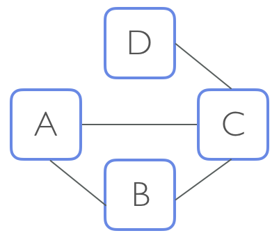
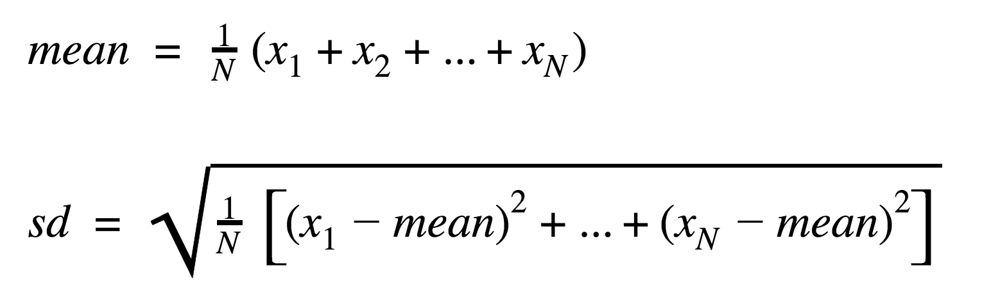

# Table of Contents
1. [Challenge Summary](README.md#challenge-summary)
2. [Details of Implementation](README.md#details-of-implementation)
3. [Anomalous Purchases](README.md#anomalous-purchases)
4. [Sample Data](README.md#sample-data)
5. [Writing Clean, Scalable, and Well-tested Code](README.md#writing-clean-scalable-and-well-tested-code)
6. [Repo Directory Structure](README.md#repo-directory-structure)
7. [Testing your Directory Structure and Output Format](README.md#testing-your-directory-structure-and-output-format)
8. [Instructions to Submit your Solution](README.md#instructions-to-submit-your-solution)
9. [FAQ](README.md#faq)

# Challenge Summary

Imagine you're at an e-commerce company, Market-ter, that also has a social network. In addition to shopping, users can see which items their friends are buying, and are influenced by the purchases within their network. 

Your challenge is to build a real-time platform to analyze purchases within a social network of users, and detect any behavior that is far from the average within that social network.

### Example

A Product Manager at Market-ter approaches you with a new idea to encourage users to spend more money, without serving them pesky ads for items. The Product Manager shows you the following diagram and says: 

"If User A makes a large purchase, we should flag them to make sure User B and User C are influenced by it. We could highlight these large purchases in their "feed". We could also send an email to User D, recommending that they become friends with User A. They won't find these emails annoying because they share the mutual friend, User C.

But we can't send our users too many emails, so we should only do this with really high purchases that are considered "anomalies" - those that are 3 standard deviations above the average within their social network. These emails will ensure that our top spenders are the most connected and influential!"

Despite the excitement, you realize the Product Manager hasn't fully thought out two specific aspects of the problem:

1. Social networks change their purchasing behavior over time, so we shouldn't average over the full history of transactions. **How many transactions should we include in the average?**

2. Users only accept "nearby" recommendations. Recommendations might work for a "friend of a friend" (`Degree = 2`), but would a "friend of a friend of a friend" (`Degree = 3`) still work? **How many "degrees" should a social network include?**

Since the Product Manager doesn't know these factors yet, your platform must be flexible enough to easily adjust these parameters. Also, it will take in a lot of data, so it has to efficiently scale with the size of the input.

# Details of Implementation
With this coding challenge, you should demonstrate a strong understanding of computer science fundamentals. We won't be wowed by your knowledge of various available software libraries but will be impressed by your ability to pick and use the best data structures and algorithms for the job.

We're looking for clean, well-thought-out code that correctly implements the desired feature in an optimized way and highlights your ability to write production-quality code and clear documentation.

## Parameters

For this challenge, you'll need two flexible parameters 

`D`: the number of degrees that defines a user's social network.

`T`: the number of consecutive purchases made by a user's social network (not including the user's own purchases)

A purchase amount is anomalous if it's more than 3 standard deviations from the mean of the last `T` purchases in the user's `D`th degree social network. As an expression, an anomalous amount is anything greater than `mean + (3 * sd)` where `sd` stands for standard deviation (see the FAQ for the mean and standard deviation). 

### Number of degrees in social network (`D`)
 
`D` should not be hardcoded, and will be at least `1`.

A value of `1` means you should only consider the friends of the user. A value of `2` means the social network extends to friends and "friends of friends".

For example, if `D = 1`, User A's social network would only consist of User B and User C but not User D.

If `D = 2`, User A's social network would consist of User B, User C, and User D.

### Tracked number of purchases in the user's network (`T`)

`T` also shouldn't be hardcoded, and will be at least `2`.

The latest purchase is the one with the highest timestamp. If 2 purchases have the same timestamp, the one listed first would be considered the earlier one.

If a user's social network has less than 2 purchases, we don't have enough historical information, so no purchases should be considered anomalous at that point. 

If a user's social network has made 2 or more purchases, but less than `T`, we should still proceed with the calucations to determine if the purchases are anomalous.

### Input Data
Ideally, the input data would come from a real-time, streaming API, but we don't want this challenge to focus on the relatively uninteresting task of connecting to an API.

As a result, you may assume that the purchases and social network events have already been collected in two logs (in the log_input directory), which we can replay to mimic the data stream.

The first file, `batch_log.json`, contains past data that should be used to build the initial state of the entire user network, as well as the purchase history of the users.

Data in the second file, `stream_log.json`, should be used to determine whether a purchase is anomalous. If a purchase is flagged as anomalous, it should be logged in the `flagged_purchases.json` file. As events come in, both the social network and the purchase history of users should get updated.

The first line of `batch_log.json` contains a JSON object with the parameters:  degree (`D`) and number of tracked purchases (`T`) to consider for the calculation.

The rest of the events in both `batch_log.json` and `stream_log.json` fall into the following 3 categories:

 * `purchase` - includes a `timestamp`, user `id` and the `amount` paid. 
 * `befriend` - two users becoming friends (all friendships are considered bi-directional)
 * `unfriend` - two users ending their friendship
 
For example, the top of `batch_log.json` could be:

    {"D":"3", "T":"50"}
    {"event_type":"purchase", "timestamp":"2017-06-13 11:33:01", "id": "1", "amount": "16.83"}
    {"event_type":"purchase", "timestamp":"2017-06-13 11:33:01", "id": "1", "amount": "59.28"}
    {"event_type":"befriend", "timestamp":"2017-06-13 11:33:01", "id1": "1", "id2": "2"}
    {"event_type":"befriend", "timestamp":"2017-06-13 11:33:01", "id1": "3", "id2": "1"}
    {"event_type":"purchase", "timestamp":"2017-06-13 11:33:01", "id": "1", "amount": "11.20"}
    {"event_type":"unfriend", "timestamp":"2017-06-13 11:33:01", "id1": "1", "id2": "3"}

While an event in `stream_log.json` could be:

    {"event_type":"purchase", "timestamp":"2017-06-13 11:33:02", "id": "2", "amount": "1601.83"}

### Output Data
Write all the flagged purchases to a file, named `flagged_purchases.json`, with the extra fields of `mean` and `sd` (the order of both the events and the json fields should remain the same as in `stream_log.json`). Please report the values of `mean` and `sd` truncated to two decimal points (e.g. `3.46732` -> `3.46`). If there is no flagged event `flagged_purchases.json` should be empty, but present.

Flagged events are still valid, and can contribute to the baseline for the social network.

An example output in `flagged_purchases.json` could be:

    {"event_type":"purchase", "timestamp":"2017-06-13 11:33:02", "id": "2", "amount": "1601.83", "mean": "29.10", "sd": "21.46"}

### Sample Data
You can find a medium sized sample data set in the `sample_dataset` folder.

### Optional Features
Feel free to implement additional features that might be useful to the company. These features will be considered as bonus while evaluating your submission, but should **NOT** interfere with the core feature (e.g. don't alter the output of `flagged_purchases.json`). If you choose to add extra features, please clearly document them in your `README` so we can evaluate them.

## Writing Clean, Scalable, and Well-tested Code

As a data engineer, it’s important that you write clean, well-documented code that scales for large amounts of data. For this reason, it’s important to ensure that your solution works well for a large number of logged events, rather than just the simple examples above.

For example, your solution should be able to account for a large number of events coming in over a short period of time, and needs to keep up with the input (i.e. needs to process a minute worth of events in less than a minute).

It's also important to use software engineering best practices like unit tests, especially since log data is not clean and predictable. For more details about the implementation, please refer to the FAQ below. If further clarification is necessary, email us at <cc@insightdataengineering.com>

Before submitting your solution you should summarize your approach, dependencies and run instructions (if any) in your `README`.  
You may write your solution in any mainstream programming language such as C, C++, C#, Clojure, Erlang, Go, Haskell, Java, Python, Ruby, or Scala. Once completed, submit a link to a Github repo with your source code.

In addition to the source code, the top-most directory of your repo must include the `log_input` and `log_output` directories, and a shell script named `run.sh` that compiles and runs the program(s) that implement the required features.

If your solution requires additional libraries, environments, or dependencies, you must specify these in your `README` documentation. See the figure below for the required structure of the top-most directory in your repo, or simply clone this repo.

## Repo Directory Structure

The directory structure for your repo should look like this:

    ├── README.md 
    ├── run.sh
    ├── src
    │   └── process_log.py
    ├── log_input
    │   └── batch_log.json
    │   └── stream_log.json
    ├── log_output
    |   └── flagged_purchases.json
    ├── insight_testsuite
        └── run_tests.sh
        └── tests
            └── test_1
            |   ├── log_input
            |   │   └── batch_log.json
            |   │   └── stream_log.json
            |   |__ log_output
            |   │   └── flagged_purchases.json
            ├── your-own-test
                ├── log_input
                │   └── your-own-log.txt
                |__ log_output
                    └── flagged_purchases.json

**Don't fork this repo*, and don't use this `README` instead of your own. The contents of `src` should not contain a single file called `process_log.py`, which is only an example. Instead, you should include your own source files and give them expressive names.

## Testing your Directory Structure and Output Format

To make sure that your code has the correct directory structure and the format of the output files are correct, we have included a test script called `run_tests.sh` in the `insight_testsuite` folder.

The tests are stored simply as text files under the `insight_testsuite/tests` folder. Each test should have a separate folder with a `log_input` folder for `batch_log.json` and `stream_log.json`, and a `log_output` folder for output corresponding to that test.

You can run the test with the following command from within the `insight_testsuite` folder:

    insight_testsuite~$ ./run_tests.sh 

On a failed test, the output of `run_tests.sh` should look like:

    [FAIL]: test_1
    [Thu Mar 30 16:28:01 PDT 2017] 0 of 1 tests passed

On success:

    [PASS]: test_1
    [Thu Mar 30 16:25:57 PDT 2017] 1 of 1 tests passed

One test has been provided as a way to check your formatting and simulate how we will be running tests when you submit your solution. We urge you to write your own additional tests in your own programming language. `run_tests.sh` is only intended to alert you if the directory structure or output is incorrect.

Your submission must pass at least the provided test in order to pass the coding challenge.

## Instructions to Submit your Solution
* To submit your entry please use the link you received in your coding challenge invite email
* You will only be able to submit through the link one time 
* Do NOT attach a file - we will not admit solutions which are attached files 
* Use the submission box to enter the link to your github repo or bitbucket ONLY
* Link to the specific repo for this project, not your general profile
* Put any comments in the README inside your project repo, not in the submission box
* We are unable to accept coding challenges that are emailed to us 

# FAQ

Here are some common questions we've received. If you have additional questions, please email us at `cc@insightdataengineering.com` and we'll answer your questions as quickly as we can (during PST business hours), and update this FAQ.

### How to calculate mean and standard deviation?

For this challenge, an anomalous amount is defined as a value that exceeds `mean + (3*sd)`

For simplicity, we can assume that the mean and standard deviation of the purchase amounts can be calculated based on the formulas below:

where N is the number of purchases and x is the amount.

### Which Github link should I submit?
You should submit the URL for the top-level root of your repository. For example, this repo would be submitted by copying the URL `https://github.com/InsightDataScience/anomaly_detection` into the appropriate field on the application. **Do NOT try to submit your coding challenge using a pull request**, which would make your source code publicly available.

### Do I need a private Github repo?
No, you may use a public repo, there is no need to purchase a private repo. You may also submit a link to a Bitbucket repo if you prefer.

### May I use R, Matlab, or other analytics programming languages to solve the challenge?
It's important that your implementation scales to handle large amounts of data. While many of our Fellows have experience with R and Matlab, applicants have found that these languages are unable to process data in a scalable fashion, so you must consider another language.

### May I use distributed technologies like Hadoop or Spark?
Your code will be tested on a single machine, so using these technologies will negatively impact your solution. We're not testing your knowledge on distributed computing, but rather on computer science fundamentals and software engineering best practices. 

### What sort of system should I use to run my program on (Windows, Linux, Mac)?
You may write your solution on any system, but your source code should be portable and work on all systems. Additionally, your `run.sh` must be able to run on either Unix or Linux, as that's the system that will be used for testing. Linux machines are the industry standard for most data engineering teams, so it is helpful to be familiar with this. If you're currently using Windows, we recommend using tools like Cygwin or Docker, or a free online IDE such as Cloud9.

### How fast should my program run?
While there are no strict performance guidelines to this coding challenge, we will consider the amount of time your program takes when grading the challenge. Therefore, you should design and develop your program in the optimal way (i.e. think about time and space complexity instead of trying to hit a specific run time value). 

### Can I use pre-built packages, modules, or libraries?
This coding challenge can be completed without any "exotic" packages. While you may use publicly available packages, modules, or libraries, you must document any dependencies in your accompanying README file. When we review your submission, we will download these libraries and attempt to run your program. If you do use a package, you should always ensure that the module you're using works efficiently for the specific use-case in the challenge, since many libraries are not designed for large amounts of data.

### Will you email me if my code doesn't run?
Unfortunately, we receive hundreds of submissions in a very short time and are unable to email individuals if their code doesn't compile or run. This is why it's so important to document any dependencies you have, as described in the previous question. We will do everything we can to properly test your code, but this requires good documentation. More so, we have provided a test suite so you can confirm that your directory structure and format are correct.

### Can I use a database engine?
This coding challenge can be completed without the use of a database. However, if you use one, it must be a publicly available one that can be easily installed with minimal configuration.

### Do I need to use multi-threading?
No, your solution doesn't necessarily need to include multi-threading - there are many solutions that don't require multiple threads/cores or any distributed systems, but instead use efficient data structures.

### What should the format of the output be?
In order to be tested correctly, you must use the format described above. You can ensure that you have the correct format by using the testing suite we've included. If you are still unable to get the correct format from the debugging messages in the suite, please email us at `cc@insightdataengineering.com`.

### Should I check if the files in the input directory are text files or non-text files(binary)?
No, for simplicity you may assume that all of the files in the input directory are text files, with the format as described above.

### Can I use an IDE like Eclipse or IntelliJ to write my program?
Yes, you can use whatever tools you want - as long as your `run.sh` script correctly runs the relevant target files and creates the `flagged_purchases.json` file in the `log_output` directory.

### What should be in the log_input directory?
You can put any text file you want in the directory since our testing suite will replace it. Indeed, using your own input files would be quite useful for testing. The file size limit on Github is 100 MB so you won't be able to include the larger sample input files in your `log_input` directory.

### How will the coding challenge be evaluated?
Generally, we will evaluate your coding challenge with a testing suite that provides a variety of inputs and checks the corresponding output. This suite will attempt to use your `run.sh` and is fairly tolerant of different runtime environments. Of course, there are many aspects (e.g. clean code, documentation) that cannot be tested by our suite, so each submission will also be reviewed manually by a data engineer.

### How long will it take for me to hear back from you about my submission?
We receive hundreds of submissions and try to evaluate them all in a timely manner. We try to get back to all applicants **within two or three weeks** of submission, but if you have a specific deadline that requires expedited review, please email us at `cc@insightdataengineering.com`.
